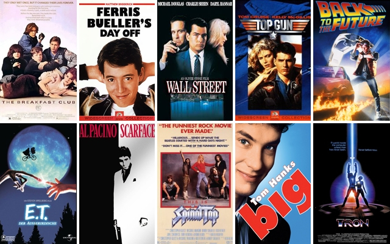
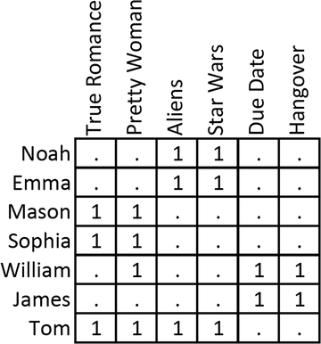

# What should I watch?
The question above is the million dollar question that we will solve.

**Structure:** 
Collaborative filtering methods will only return movies thats is correlated to the movie you've just watched based on how users rated the movie. Since, this method only returns the correlation coefficient, how would we measure performance?

Normally, performance is measured in a post A|B test against other engines (content based, popularity, trending, etc..). We will attempt to solve this in a different manner. We will first create a model that will predict how a user will rate a movie, then pair this model with the collaborative filtering to predict how the user will rate the movies being recommended to them.

1. Create a model that can predict what rating a user will give to a movie this [Notebook](predict_rating_model.ipynb)
2. Create a recommendation engine using collaborative filtering this [Notebook](rec_engine_collab.ipynb)(Output #17 & #25)
3. Use model to predict how the user will rate the movies being recommended to them (Output #23, #28, #31 & #34)
4. The final output that includes all of the controls can be found on this [Notebook](rec_engine_collab_part_2.ipynb)

**Recommendation Engine Overview:** 
Using movies & ratings datasets we will create two recommendation engine to predict what movies we should watch. Both engines will use **collaborative filtering** as the preferred method:
1. Item to item
2. Hybrid: User to user, followed by item to item

In a general sense, the engine will group similar users and similar items.

**Method:** 
Typically, the workflow of a collaborative filtering system is:

1. A user expresses his or her preferences by rating items (e.g. books, movies or CDs) of the system. These ratings can be viewed as an approximate representation of the user's interest in the corresponding domain.
2. The system matches this user's ratings against other users' and finds the people with most "similar" tastes.
3. With similar users, the system recommends items that the similar users have rated highly but not yet being rated by this user (presumably the absence of rating is often considered as the unfamiliarity of an item)

A key problem of collaborative filtering is how to combine and weight the preferences of user neighbors. Sometimes, users can immediately rate the recommended items. As a result, the system gains an increasingly accurate representation of user preferences over time. ~ Wikipedia (https://en.wikipedia.org/wiki/Collaborative_filtering)  

  
